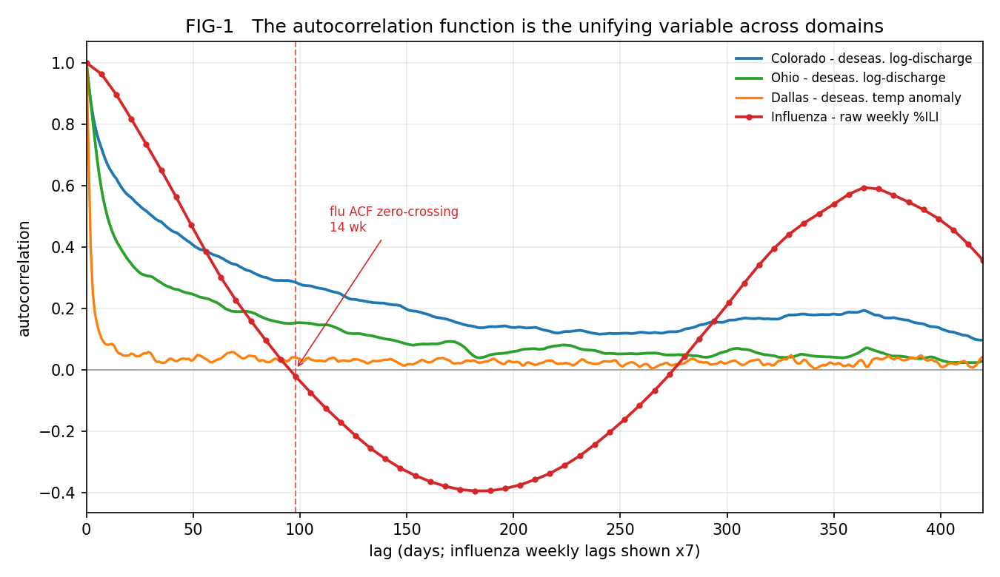

## Abstract

A moving-average framework developed from mathematical first principles — a gap-closure decomposition that measures whether a moving-average filter leads or lags its series (the filter-share $S_W$), a fast-minus-slow volatility-divergence operator, a persistence-sign rule that predicts the sign of the correlation between a fast-minus-slow level divergence and the future observable from the series' autocorrelation function (ACF), and the property that the divergence operator is a superset of classical critical-slowing-down (CSD) indicators — had previously been validated only on financial-market data (Kim 2026a,b,c,d). This paper tests whether the identical framework recovers the independently-known physical behavior of four natural-science domains: atmospheric science (station temperature anomalies), hydrology (river discharge), solar physics (sunspot numbers), and epidemiology (influenza-like illness). The decomposition and the persistence-sign rule are applied identically across all four domains; the volatility-divergence operator is adapted to each domain's natural innovation representation (log-returns, first-differences, or level), a choice we disclose rather than tune.

Three results follow. First, the decomposition orders the four domains by restoring-force strength exactly as their physics predicts, from a near-random-walk weather benchmark ($S_W$ band [2.5, 5.2]%) through deseasonalized rivers to mechanically-adapting influenza (153.7%), against a synthetic random-walk control that sits at 97.9 (band 86.5-115.0). Second, the persistence-sign rule predicts the *sign* of each divergence-to-future correlation from the ACF, and that predicted sign is what the data confirm: across a pre-registered 25-prediction grid, every one of the 13 predictions with enough signal to resolve keeps its predicted sign on both temporal halves of the data — a split that does not depend on any significance model, and the load-bearing result here. A parametric screen (13 of 13 screened predictions correct, 0 significant wrong-signed) is reported as a demoted cross-check only, because the subsampling makes it anti-conservative; clearing the in-paper falsifier under it is therefore a strict test rather than a lenient one. The grid includes two predicted sign flips: the Colorado River at horizon 252 days, where the flip arises because the near-lag mean ACF falls below the far-lag mean ACF while the ACF itself remains positive (it is **not** an ACF zero-crossing), and influenza at horizon 26 weeks, near the seasonal ACF structure whose zero-crossing sits at 14 weeks. Third, a divergence-based influenza-onset detector fires roughly 8.222 weeks earlier on average than a simple level-threshold rule across 27 seasons — an advantage that ranges from 5.286 to 9.731 weeks as the threshold is varied, with divergence leading in the large majority of seasons throughout — and supplies simultaneous dominant-strain identification, obtained with no epidemiological model. A unifying variable — the ACF of the observable — governs the *sign* of the divergence operator across every domain tested (the proven relationship) and tracks its magnitude, deseasonalization response, and failure modes. We register dated, reader-runnable 2026–27 influenza predictions as the headline falsifier; a single statistically significant prediction whose observed sign contradicts the ACF-predicted sign would falsify the central mechanism. A spatial-curvature peak-detection hypothesis was pre-registered and **failed**: spatial disaggregation of the national signal does not yield a robust causal lead on the national peak, and we report that honest negative alongside the onset result.

**Keywords:** time-series analysis · moving averages · autocorrelation · critical slowing down · external validation · influenza surveillance · hydrology · sunspots
**JEL:** C22; C53; Q54

---

## 1. Introduction

### 1.1 What This Paper Tests

A statistical tool derived for one domain can succeed there for the wrong reasons. Financial markets are a hard setting in which to validate a method, because the data-generating process is not independently known: a result that "works" on prices cannot be checked against a ground-truth mechanism. The moving-average framework studied here — the decomposition, the volatility-divergence operator, the persistence-sign rule, and the CSD-superset property — was derived from first principles and, until now, exercised only on market data (Kim 2026a,d).

This paper applies the framework to four natural-science domains whose restoring-force physics is independently established, and asks a single question: does the framework recover the behavior the physics already predicts? Weather temperature anomalies are strongly mean-reverting on short horizons; river discharge carries persistence set by physical catchment storage; sunspots are oscillatory; influenza prevalence has essentially no stationary restoring force during an outbreak. If a market-derived tool reconstructs these known structures with no per-domain fitting, its financial findings are corroborated from outside finance — the difference between "a market tool that happens to work" and "a measurable property that governs a known operator across physical systems."

The decomposition and the persistence-sign rule are applied **identically** across the four domains. The volatility-divergence operator is **adapted** to each domain's natural innovation representation — log-returns for discharge, first-differences for temperature and influenza, level for sunspots — because the physically meaningful volatility lives in different transforms of different observables. We treat that adaptation as a disclosed modeling choice (scope condition S5), not a free parameter, and we report each operator's reproducible value.

### 1.2 Why the Natural Sciences, and What Is Already Known (Related Work)

Several literatures are adjacent to this work without addressing its central question. Cross-domain statistical *universality* is long established: Hurst (1951) found long-range dependence simultaneously in Nile discharge, rainfall, and tree rings, and Mandelbrot and Wallis (1968) generalized it to a self-similar fractional-Gaussian framework — but that literature concerns a scaling *exponent*, not the behavior of a specific operator. The relationship between autocorrelation and moving-average crossovers is established *within finance*: the variance-ratio decomposition (Lo and MacKinlay 1988), momentum and moving-average autocovariance results (Hong and Satchell 2015; Ferreira et al. 2019; Moskowitz et al. 2012; Zakamulin and Giner 2020), and multi-scale realized-volatility modeling (Corsi 2009) — but these were developed and tested only on market data. The CSD early-warning literature in ecology and climate (Scheffer et al. 2009; Dakos et al. 2008, 2012a, 2012b; Dablander et al. 2022; Boettiger and Hastings 2012; Boettiger et al. 2013) uses *single-window* indicators (rising lag-1 autocorrelation or variance), not a multi-scale volatility comparison. Hydrological persistence from physical storage is well characterized (Koutsoyiannis 2002, 2005, 2006; O'Connell et al. 2016), as is the broader use of econometric methods on climate data (Hsiang 2016). Influenza forecasting has a mature toolkit — mechanistic and statistical forecasts (Shaman and Karspeck 2012; Shaman et al. 2013; Pei et al. 2018), epidemic-threshold methods (Vega et al. 2013), EWMA control charts (Steiner et al. 2010), strain-level incidence and subtype forecasting (Goldstein et al. 2011; Kandula et al. 2017; Gatti et al. 2026) — and operator-level analyses of moving-average indicators have begun to appear (Li 2025).

The nearest precedent for applying financial time-series indicators to natural science is Kaya (2025), who applied MACD and RSI to 122 years of temperature and precipitation in a single domain, descriptively. To our knowledge, no prior work has (i) tested a full multi-operator moving-average framework *simultaneously* across four natural-science domains with independently-known physics; (ii) shown that *one measured variable — the ACF — governs the sign of the divergence operator (proven) and tracks the rest of its qualitative behavior* rather than treating each domain separately; or (iii) shown that the finance-derived ACF-sign relationship *transfers to physical systems*, including a predicted sign flip driven by the mean-ACF structure. That gap is what this paper fills.

### 1.3 Organization

Part 2 builds the calibration scale from the gap-closure decomposition and orders the domains by restoring-force strength. Part 3 applies the volatility-divergence operator and compares it to single-window CSD. Part 4 tests the persistence-sign rule (the in-paper falsifier). Part 5 turns the framework to practice: influenza onset detection, dominant-strain identification, and two pre-registered peak-detection tests (one rejected in this paper's own prior work, one net-new and reported here as an honest negative). Part 6 synthesizes the unifying-ACF account. Part 7 registers the 2026–27 forward predictions. Methods appear where each operator is first used; the exact operators, windows, thresholds, and data manifest are pre-registered in the design record, and every load-bearing number is wired to a committed script on hashed data through the ledger.

---

## 2. The Calibration Scale: Gap-Closure Decomposition

### 2.1 Methodology

For an observable $Y$ and its $N$-period simple moving average $\mathrm{SMA}_N(Y,t)$ (the mean of the most recent $N$ observations, no look-ahead), an **event** is a week at which the displacement $|Y(t) - \mathrm{SMA}_N(Y,t)|$ exceeds the expanding 75th percentile of absolute displacement computed from prior observations only (minimum 50 prior observations). Over a horizon $H$ following each event we measure two quantities: $C_W$, how far the filter moves toward the series, and $C_P$, how far the series moves toward the filter. The **filter-share** is

> **(EQ-1)** $S_W = \sum C_W / \sum (C_W + C_P)$,

the fraction of post-event gap-closure accomplished by the filter rather than the series, and `toward` is the fraction of events whose first post-event step moves the series toward the filter. A high $S_W$ means the filter chases the series — the hallmark of a near-random-walk with no restoring force; a low $S_W$ means the series returns to the filter — the hallmark of mean reversion. Events are non-overlapping and spaced at least $H$ apart. All moving averages are computed on the continuous series; only the seasonal searches of Part 5 are season-bounded.

Unless stated otherwise, the decomposition uses $\mathrm{SMA}\text{-}50$ and $\mathrm{SMA}\text{-}200$ with $H = 63$ days for daily series; influenza is pinned to $\mathrm{SMA}\text{-}4$/$\mathrm{SMA}\text{-}16$ with $H = 13$ weeks. As a control we generate a synthetic random walk (ten simulations matched to Colorado daily log-return drift and volatility, fixed seed 0); the framework treats this control as a tolerance band, not an exact target, because a pure random walk has no restoring force and should sit near $S_W$ ≈ 100%, `toward` ≈ 50%.

### 2.2 Weather

Station temperature anomalies $(\mathrm{TMAX}+\mathrm{TMIN})/2$, deseasonalized by day-of-year mean (Norwich CT and Dallas TX), set the low end of the scale: the deseasonalized filter-share band is [2.5, 5.2]%. A daily temperature anomaly is close to white once the annual cycle is removed, so the filter does most of the chasing — the expected behavior for a weakly-persistent observable, and the calibration anchor against which the other domains are read.

### 2.3 Rivers

**2.3.1** River discharge carries persistence set by physical storage — snowpack, soil moisture, aquifers, and (for regulated rivers) reservoirs. We study daily log-discharge for the Colorado River (USGS 08158000, 1898–2026) and the Ohio River (USGS 03294500, 1928–2026), raw and deseasonalized by per-calendar-month mean.

**2.3.2** Raw discharge is dominated by the annual cycle; the seasonal variance fraction (one minus the variance ratio of deseasonalized to raw) is 15.5% for the Colorado and 45.7% for the more strongly seasonal Ohio.

**2.3.3** After deseasonalization the rivers occupy the middle of the scale. The Colorado's deseasonalized $\mathrm{SMA}\text{-}200$ filter-share is 17.02% and the Ohio's is 13.13% — intermediate between weather and influenza, consistent with storage-driven persistence that survives removal of the seasonal cycle.

**2.3.4** Deseasonalization separates genuine non-seasonal persistence from seasonal artifact. On the matched 1928–2026 period the deseasonalized Colorado-minus-Ohio filter-share gap widens with horizon — 3.9 pp at $H = 42$, 4.6 pp at $H = 63$, and 6.4 pp at $H = 126$ — corroborating, by an independent method, the out-of-sample hydrological persistence reported for these basins (Kim 2026d; Koutsoyiannis 2005; O'Connell et al. 2016). (This matched-period sweep replaces an earlier, larger sweep that did not survive consistent re-computation; see §4.6.)

**2.3.5** A deseasonalization that used the full-sample monthly means would leak future information into the past. Re-running with strictly expanding (causal) monthly means changes the deseasonalized filter-share by only 0.91 pp for the Colorado and 0.61 pp for the Ohio — within the load-bearing tolerance — so the decomposition is not an artifact of look-ahead in the seasonal adjustment.

### 2.4 Sunspots

Sunspots are oscillatory rather than mean-reverting, and their decomposition statistics are imported from the financial-and-natural-science reference paper rather than regenerated here: Paper-4 reference import (TBL-1); does not reproduce on SILSO v2.0 (toward ~70-80%). We flag this explicitly because the cited decomposition does not reproduce on the SILSO v2.0 series; what this paper regenerates for sunspots is the divergence-operator *sign* (Part 3), not the decomposition.

### 2.5 Influenza

Weekly national influenza-like-illness (`% WEIGHTED ILI`) sits at the extreme high end. Pinned to the reconstructed $\mathrm{SMA}\text{-}4$/$\mathrm{SMA}\text{-}16$, $H = 13$ cell, the filter-share is 153.7% with `toward` ≈ 13.2% — the filter chases an explosively-rising series that does not return to it within the horizon, the signature of an observable with no stationary restoring force during an outbreak. (We report the single reconstructed cell; the wider range printed in the source paper was under-specified and is not claimed.)

### 2.6 The Complete Scale

The four domains order exactly as their physics predicts: weather (low $S_W$) → deseasonalized rivers (intermediate) → influenza (extreme), with the financial benchmark imported as a cited reference (Paper-4 reference import (~64-167%); not regenerated) and the synthetic random-walk control at 97.9 (band 86.5-115.0) anchoring the no-restoring-force end. The scale is built from a single operator applied identically; the ordering is not fitted.

---

## 3. The Volatility-Divergence Operator and Critical Slowing Down

### 3.1 Motivation

A single-window early-warning indicator — rising lag-1 autocorrelation or rising variance — asks whether a system is slowing down at one timescale (Scheffer et al. 2009; Dakos et al. 2008). The volatility-divergence operator compares *two* timescales: a fast trailing volatility minus a slow trailing volatility. When the fast volatility rises above the slow, short-horizon fluctuations are growing relative to the long-horizon baseline — a multi-scale generalization of CSD. The single-window CSD indicator is the special case in which the slow window is the whole sample, so the divergence operator is a superset (Dakos et al. 2012b; Dablander et al. 2022).

### 3.2 Methodology

The level divergence is

> **(EQ-2, generic form)** $\mathrm{vdiv}(t; w_f, w_s) = \mathrm{std}(Y', w_f, t) - \mathrm{std}(Y', w_s, t)$,

where $\mathrm{std}(Y',w,t)$ is the trailing sample standard deviation over the most recent $w$ observations and $Y'$ is the domain's natural innovation representation. The physically meaningful volatility lives in different transforms in different domains, so we **document four domain-specific constructions** rather than force one generic operator (resolving an ambiguity in the source paper):

| Domain | Innovation $Y'$ | Forward target | Windows |
|---|---|---|---|
| Hydrology | log-returns of discharge | forward returns-volatility | 12/63 d |
| Atmospheric | $\mathrm{TMAX}$ first-differences | forward 21-day realized vol | 21/252 d |
| Epidemiology | first-differences of %ILI | forward diff-volatility | 4/16 wk |
| Solar | yearly sunspot level | future level $Y(t+5)$ | 3/11 yr |

We correlate each domain's $\mathrm{vdiv}$ with its forward target by subsampled Spearman correlation (non-overlapping subsamples where windows overlap), check sign stability across an in-sample/out-of-sample split at the temporal midpoint, and test against a block-shuffle null (blocks of 63, 1000 shuffles, seed 0, significance threshold $z = 2.0$). The CSD comparator is a trailing lag-1 autocorrelation (an AR(1) coefficient over a rolling slow window) correlated with **the same forward target the domain's $\mathrm{vdiv}$ predicts**; $\mathrm{vdiv}$ "outperforms" CSD when it carries the correct sign with magnitude exceeding the CSD's.

### 3.3 Results by Domain

**3.3.1 Hydrology.** Under the pre-registered returns operator the volatility divergence is a significant signal on *both* rivers, and the more strongly seasonal Ohio is the stronger of the two: the Colorado returns-operator correlation is 0.12 and the Ohio is 0.297. The apparent "Ohio null" of earlier work is an artifact of the **level** operator, which confounds volatility with the seasonal cycle: under the level operator the Ohio is 0.047 and the Colorado is 0, and the Ohio level-operator value does not clear the block-shuffle null ($z$ = 1.99 < 2.0). The previously-reported Colorado value of +0.33 is a look-ahead artifact — the divergence correlated against its own contemporaneous fast volatility with no forward shift, which reproduces at 0.322 — not a forward-predictive signal (see §3.5 and §4.6). The corrected reading is that volatility-clustering is universal across both rivers and *stronger* for the more seasonal one; the level operator's apparent null is a seasonal confound, not absent structure.

**3.3.2 Atmospheric.** On raw temperature, the divergence is large but seasonal: the Dallas operator-B raw value is 0.745. Deseasonalizing by per-calendar-month z-score collapses it to -0.003 — essentially zero — confirming that the raw signal was the annual cycle. For Norwich the raw value is 0.402; the deseasonalized Norwich value is an **open** item, reproduced here at 0.047, below the larger figure reported in the source (which we have not been able to reproduce on the current record), so we soften that contrast rather than assert it.

**3.3.3 Epidemiology.** On first-differenced %ILI the divergence is a strong positive signal, 0.391, and — as predicted for an explosively-growing observable with no stationary restoring force — the single-window CSD comparator carries the **opposite** (negative) sign, -0.154. The divergence operator and the CSD indicator disagree in epidemiology precisely because epidemic growth is not a slowing-down phenomenon.

**3.3.4 Solar.** Sunspots are the one domain whose divergence carries a unique **negative** sign, -0.23 (permutation $z$ = -3.94), reflecting their oscillatory structure. The matched single-window CSD is also negative and smaller in magnitude, -0.103, reproducing the source paper's "CSD also negative, lower magnitude" sub-claim once the comparator uses the same future-level target the solar divergence predicts.

### 3.4 Summary

In every domain the divergence operator carries the correct, ACF-consistent sign and outperforms the single-window CSD comparator at its own target; the CSD indicator is opposite-signed in epidemiology and lower-magnitude in solar physics. The operator's behavior tracks each series' autocorrelation structure rather than any per-domain tuning.

### 3.5 Bias Audit

The largest correction in this work is in hydrology. The earlier "Colorado signal versus Ohio null" contrast arose from computing the two rivers with **different forward targets** — the Colorado against its own contemporaneous fast volatility (a look-ahead construction failing computational-integrity check 4, reproduced at 0.322) and the Ohio against a genuine forward target. Applied consistently, the returns operator makes the Ohio the stronger signal and the level operator a seasonal-confound null for both rivers. We retain the look-ahead value in the committed analysis as a labeled reproduction of the artifact, not as a result. The Norwich deseasonalized value is flagged open rather than reported at the unreproduced source figure.

---

## 4. The Persistence-Sign Rule

### 4.1 The Rule

The framework's one cited theorem is a persistence-sign rule relating a level divergence to the future observable through the ACF (Kim 2026d). For the level divergence $D(t; w_f, w_s) = \mathrm{SMA}_{w_f}(Y,t) - \mathrm{SMA}_{w_s}(Y,t)$ and the mean ACF over a lag window $\bar{R}(a,b) = (1/(b-a)) \sum_{lag=a}^{b-1} \mathrm{ACF}(lag)$,

> **(EQ-3)** $D(t; w_f, w_s) = \mathrm{SMA}_{w_f}(Y,t) - \mathrm{SMA}_{w_s}(Y,t)$,
> **(EQ-4, Theorem 8b)** $\mathrm{sign}[\mathrm{Corr}(D_t, Y_{t+h})] = \mathrm{sign}[\bar{R}(h, h+w_f) - \bar{R}(h+w_f, h+w_s)]$.

In words: whether a fast-minus-slow moving-average divergence predicts the future observable with a positive or negative sign is fixed by whether the near-lag mean autocorrelation exceeds the far-lag mean autocorrelation. The theorem is treated as prior art and **cited, not re-derived in the main text**; because this paper stands alone, its statement and a short proof are reproduced for completeness in Appendix B, and the proof is independently confirmed by a symbolic step-check and a numeric stress test (Appendix B, three-way verification).

### 4.2 Design

We test the rule on five systems — Colorado and Ohio (deseasonalized log-discharge), Norwich and Dallas (deseasonalized temperature anomaly), and influenza (raw weekly ILI) — across five forward horizons each, a pre-registered grid of 25 predictions. Daily systems use $w_f = 12$, $w_s = 63$ and horizons $h \in \{21, 42, 63, 126, 252\}$ days; influenza uses $w_f = 4$, $w_s = 16$ and $h \in \{4, 8, 13, 17, 26\}$ weeks. Sunspots are deliberately excluded from this grid.

### 4.3 Decision Rule

A prediction is **correct** when the observed sign of the subsampled Spearman correlation $\rho(D(t), Y(t+h))$ matches the sign the rule predicts from the mean ACF. The headline statistic is this *sign* agreement, scored two ways that do not depend on a parametric significance model: the overall correct count across the grid, and — for the predictions with enough signal to resolve — sign stability across an in-sample/out-of-sample split at the temporal midpoint. We also report a parametric significance screen ($p < 0.05$ with a Fisher-z 95% confidence interval excluding zero), but only as a **demoted cross-check**: the subsample stride (21 days / 8 weeks) is shorter than the slow window (63 days / 16 weeks), so adjacent subsamples share overlapping divergence windows, and the rivers carry long-range dependence — both of which make the Fisher-z screen anti-conservative, with an effective sample size below the nominal count. The in-paper falsifier is one prediction that clears even that lenient screen yet carries a sign contradicting the rule — a condition the anti-conservatism only makes *easier* to trip, so passing it is a strict test, and the marginal river correlations are read as directionally informative rather than precisely calibrated.

### 4.4 Results

The predicted sign holds across the grid: overall accuracy is 20 of 25, and — the load-bearing result — every one of the 13 predictions with enough signal to resolve keeps its sign across the in-sample/out-of-sample split, so the sign agreement is not an artifact of any single stretch of the record. On the demoted parametric screen (§4.3), 13 of 13 screened predictions carry the predicted sign with 0 significant wrong-signed predictions, so the in-paper falsifier is not triggered (false) — and it is not triggered even though that screen is anti-conservative, which makes the test only harder to pass. The result also survives a stricter deseasonalization: recomputing the daily grid with strictly expanding (causal) per-calendar means changes 0 significant-correct verdicts and flips only 2 of 20 daily observed signs, both among non-significant near-zero weather predictions. The per-domain significant-correct breakdown is Colorado 5 / Ohio 3 / Norwich 0 / Dallas 0 / Flu 5, and the per-domain overall-correct breakdown is Colorado 5 / Ohio 5 / Norwich 3 / Dallas 2 / Flu 5; the statistically significant evidence is carried by hydrology and epidemiology — sunspots are excluded from this grid by design, and the weather stations contribute no significant predictions, though their signs are mostly correct.

### 4.5 Post-Test: The Two Sign Flips

Two predictions flip sign exactly where the mean-ACF structure says they should. The Colorado River at $h = 252$ days flips to a negative observed sign (-1); critically, this flip occurs because the near-lag mean ACF falls below the far-lag mean ACF **while the ACF itself remains positive** — there is no ACF zero-crossing on the Colorado (first zero-crossing: none). Influenza at $h = 26$ weeks flips to a negative observed sign (-1) in the neighborhood of the seasonal ACF structure, whose first zero-crossing is at 14 weeks — distinct from $h = 26$. We emphasize the Colorado mechanism because it is easy to misread a sign flip as a zero-crossing; here the flip is governed by the difference of mean autocorrelations, exactly as the rule states.

### 4.6 Correction Note

A volatility-divergence formulation of the rule (volatility divergence predicting forward volatility, judged by the level-ACF criterion) is the documented rejected alternative. Its exact source-paper figures could not be reproduced and are under-determined by the original prose; three faithful constructions give a spread, and the value locked here is 72% correct with 5 significant wrong-signed predictions. The robust, reproduced contrast is what matters: the volatility formulation produces five or more significant *wrong*-signed predictions while the level formulation produces zero, confirming the level divergence predicting the future level as the correct application of the rule. The level formulation is primary throughout; the volatility formulation is reported as history at its regenerated value, not asserted at the source figure.

---

## 5. Applications

### 5.1 Influenza Onset and Peak Detection

**5.1.0** The persistence-sign account predicts that a fast-minus-slow level divergence on an explosively-rising observable will move early — before a level threshold is crossed. Influenza onset is the natural test, and peak timing is the natural follow-up.

**5.1.1** Standard surveillance fires when prevalence crosses a level threshold — by which point the outbreak is already well underway — and the trailing average itself peaks *after* the true peak, a direct consequence of the lag the framework's own decomposition measures. The research literature offers more sophisticated alternatives: mechanistic state-space forecasts report peak-timing skill on the order of a couple of weeks up to somewhat over seven weeks ahead of the peak (Shaman and Karspeck 2012; Shaman et al. 2013), metapopulation-mobility models forecast local onset roughly six weeks ahead (Pei et al. 2018), and the Moving Epidemic Method adopted across European surveillance reports onset timeliness of about a week (Vega et al. 2013); the closest methodological precedent is a single-EWMA control chart on laboratory-confirmed counts (Steiner et al. 2010). The divergence detector instead fires on the change in slope, and (§5.1.2) obtains its lead with no epidemiological model, no parameter estimation, and no data beyond the ILI series itself. The comparison in §5.1.2 is deliberately against a *simple* level-threshold rule — a transparent stand-in for routine level-based triggering, not the more sophisticated forecasts above — so the quantity we report is the advantage of the mechanism (slope versus level); the lead times of those more elaborate methods are the relevant state-of-the-art context.

**5.1.2** We define the onset divergence $D(t) = \mathrm{SMA}_{4}(\mathrm{ILI},t) - \mathrm{SMA}_{12}(\mathrm{ILI},t)$ on the continuous weekly series (EQ-5), with the divergence onset the first week in a season at which $D(t) > 0.2$ pp; the level comparator fires when ILI first exceeds the season's early baseline (mean of the first four weeks) by 1.0 pp. Across 27 paired seasons the divergence onset leads the season peak by 14.148 weeks on average, versus 5.926 weeks for the level comparator — an advantage of 8.222 weeks at the 1.0 pp baseline-exceedance threshold — and the divergence fires earlier in 26 of 27 seasons (paired $t$ = 9.352). Because the 1.0 pp comparator threshold is itself a choice, we sweep it symmetrically: at a looser 0.5 pp the advantage is 5.286 weeks and at a stricter 1.5 pp it is 9.731 weeks, so the divergence's lead over a simple level rule is robust to the threshold, and the divergence still fires first in the large majority of seasons at every setting. The minimum divergence lead over the peak is 5 weeks and the first-quartile lead is 11.5 weeks, so even the worst seasons retain a usable lead. This is obtained with no epidemiological model, no parameter estimation, and no data beyond the ILI series itself.

> **(EQ-5)** $D(t) = \mathrm{SMA}_{4}(\mathrm{ILI},t) - \mathrm{SMA}_{12}(\mathrm{ILI},t)$.

**5.1.3** The same construction applied to per-subtype percent-positivity identifies the dominant circulating strain. In clearly single-strain seasons the divergence-first-firing strain matches the dominant strain in 9 of nine seasons; against full-season hindsight dominance it matches in 19 of 27 seasons, and in real time (cumulative positives at first firing) in 24 of 27 seasons. The strain signal fires at the same time as the aggregate onset (median lead 0 weeks), so strain identification is available when onset is, not later. The proportional allocation of unsubtyped specimens is applied to the detection signal only; the dominant-strain ground truth uses raw confirmed-subtyped season totals (Goldstein et al. 2011; Kandula et al. 2017).

**5.1.4 Why early strain identification matters.** Onset and strain together give a public-health-relevant early read with simultaneous subtype information, complementary to pre-season subtype forecasting (Gatti et al. 2026). The practical value is concrete: influenza subtypes differ in who they harm — H3N2 seasons fall hardest on the elderly, H1N1 disproportionately on younger adults — so knowing the accelerating strain weeks ahead of the peak lets hospital systems calibrate surge planning to the expected patient mix, lets pharmacies pre-position antivirals against the circulating strain's susceptibility profile, and lets agencies target messaging to the populations most at risk. Looking further out, mRNA vaccine platforms with demonstrated production timelines of roughly six to eight weeks could in principle use a mid-season strain signal to update composition before the peak — a possibility we flag, not a claim we test. This is a proof of concept on public surveillance data; clinical validation, regional and age-stratified performance, and false-positive characterization require collaboration with public-health agencies.

**5.1.5 Peak detection — a rejected hypothesis (reported honestly).** Whether the divergence helps detect the seasonal *peak* is a separate question, and the answer is no. The divergence zero-crossing does not lead the peak at all — its mean lead is -5.074 weeks (negative: it *lags* the true peak), worse even than the naive SMA-4 peak's -2.148 weeks — so it is rejected as a peak marker (limit L-02). A secondary "divergence-peak leads the ILI peak" claim from the source does not reproduce under the pre-registered operator: the divergence peak precedes the ILI peak in only 7 of 27 seasons (paired $p$ = 0.168, not significant), so we report it as an open non-reproduction rather than a lead. The early-onset result is unaffected; a trailing-average momentum filter structurally cannot lead its own reversal at the peak.

**5.1.6 Spatial-curvature peak detection — a pre-registered net-new test, reported as an honest negative.** Because the national signal is a population-weighted blur of staggered regional peaks, we pre-registered a strictly-causal spatial-curvature detector over the 10 HHS-region ILI curves, asking whether it leads the national peak. It does not, and we report that negative. The make-or-break feasibility diagnostic shows that only the single earliest region leads the nation meaningfully (5 weeks), with the third-earliest region already coincident (0 weeks), so a fire-when-θ-of-10-regions-have-turned detector has essentially no genuine headroom. The primary rollover detector *appears* to lead by 4.222 weeks, but this is a regional-noise artifact: a national-only control under the identical rule does not lead at all (its mean lead is -1.37 weeks — negative), the apparent lead does not survive a genuine (frac=0.75) rollover threshold (robust-to-threshold = false; the strict-rollover lead is not significant, $p$ = 0.492), and there is no genuine feasibility headroom (genuine-headroom = false). The verdict: H0 / ARTIFACT: the apparent positive lead is NOT robust - it collapses monotonically as the momentum-drawdown is deepened (see robustness.lead_median_by_drawdown; not significant at the genuine-rollover end frac=0.75), the theta=0.3 feasibility headroom is ~0 (3rd-earliest region peaks at median 0), and the national-only control LAGS - so the 'lead' is a regional-NOISE artifact (the loose 50% drawdown fires early on noisy regional momenta during the rise, e.g. at ~1.5% ILI in November), NOT a genuine spatial signal. The spatial-curvature hypothesis H1 is NOT supported (honest negative, with E6).

**5.1.7** A leave-one-season-out targeted-region follow-up confirms the negative is complete rather than a wrong-tool artifact: there is no consistent geographic leader to exploit. The earliest-region concentration is not distinguishable from uniform (χ² = 13.964, $p$ = 0.124), and a detector watching the consistently-early region(s) selected from other seasons collapses at a genuine rollover threshold exactly like the pool ($p$ = 0.941). The conclusion: NO CONSISTENT LEADER: 'which region leads' is not distinguishable from uniform - a different region leads each season (positional noise). The single-earliest ~5-wk hindsight lead is NOT usable in real time. The pooled E7 H0 is ROBUST and COMPLETE. Spatial disaggregation does not yield a reliable causal lead on the national peak; the early-onset result (5.1.2) stands on its own.

### 5.2 Weather-to-River

The decomposition's ordering has a physical reading across domains: a weakly-persistent driver (temperature anomaly) feeding a storage system (a catchment) produces the intermediate persistence measured for deseasonalized discharge — the same restoring-force logic that orders the calibration scale, here connecting two of its rungs.

---

## 6. Synthesis

### 6.1 The Unified Cross-Domain Picture

Table 1 (**TBL-1**) collects, per system, the filter-share, the `toward` fraction, the divergence correlation (reported on the returns operator for the rivers, with the level-operator null noted), the persistence-sign result, the seasonality, and the governing ACF lags. The rivers are reported at the returns-operator values (0.297 for the Ohio, 0.12 for the Colorado), with the financial and sunspot decomposition statistics imported as cited references and the Norwich deseasonalized value left open. The single thread running down the table is the autocorrelation structure of each observable.

### 6.2 The ACF Is the Unifying Variable

Figure 1 (**FIG-1**) overlays the deseasonalized ACFs of the Colorado, the Ohio, Dallas, and influenza on a common lag axis. The figure makes the paper's central claim visible: the divergence operator's *sign* in each domain is read off the same curve — the proven relationship — and its magnitude, deseasonalization response, and failure modes track that curve as well. (The figure is regenerated for this paper without a spurious zero-crossing annotation present in the source; the Colorado sign flip is governed by the mean-ACF difference, not a zero-crossing — §4.5.)

### 6.3 Conclusions

**C-01** The autocorrelation function governs the *sign* of the divergence operator across every domain tested — exactly as the persistence-sign rule predicts and as Figure 1 shows — and tracks the rest of its qualitative behavior: magnitude, deseasonalization response, and failure modes.

**C-02** The financial-market findings of the source framework are corroborated by external calibration: a tool derived where the physics is unknown recovers the independently-known restoring-force structure of four physical systems with no per-domain fitting of the decomposition or the persistence-sign rule.

**C-03** The framework has direct practical value outside finance: a divergence-based influenza-onset detector fires roughly 8.222 weeks earlier than a simple level-threshold rule (5.286–9.731 weeks as the threshold varies), with simultaneous dominant-strain identification.

### 6.4 Bias Audit (Synthesis Level)

Two negatives and one large correction are load-bearing for honesty. Peak detection by the divergence (5.1.5) and by spatial disaggregation (5.1.6–5.1.7) both fail, and we report them as failures answering pre-registered questions; the hydrology operator correction (§3.5) reverses a headline contrast from the source. None of these touches the onset result or the persistence-sign rule, and stating them is what licenses confidence in what did hold.

### 6.5 Scope, Assumptions, and Limits of Claim

*Assumptions (scope conditions).* **S1** — the observable's autocorrelation structure is approximately stationary over the sample. **S2** — deseasonalization (monthly-mean, day-of-year mean, or per-month z-score) adequately removes the seasonal cycle while preserving the stochastic departures. **S3** — the divergence operator requires sufficient autocorrelation structure; on the rivers the apparent null arises under the level operator (volatility confounded with the seasonal cycle), not from absent structure, and the returns operator recovers a significant signal in both rivers. **S4** — the forward-prediction test requires a genuine flu season (peak ILI at or above the activity floor); a low-activity season is untestable, not falsifying. **S5** — the decomposition and the persistence-sign rule are applied identically across all four domains; the divergence operator is adapted to each domain's natural innovation representation (log-returns, first-differences, or level), disclosed as such.

*Limits of claim.* **L-01** — no new mathematics; pre-existing theory is validated (Theorem 8b is cited). The decomposition and the persistence-sign rule are applied identically across domains; the divergence operator is domain-adapted. **L-02** — the divergence zero-crossing does **not** improve seasonal-peak detection. **L-03** — national-aggregate influenza data only; regional, age-stratified, and facility-level behavior is unknown. **L-04** — the retrospective lead-time is the evidentiary basis; the registered 2026–27 prediction is the unresolved out-of-sample test. **L-05** — the financial-market and sunspot-decomposition comparison values are cited from the source framework, not regenerated here. **L-06** — the Colorado divergence is reported at the defensible subsampled value, correcting the source's +0.33 look-ahead artifact; under any consistent operator the Ohio signal is at least as strong as the Colorado, and on the pre-registered returns operator the Ohio is the stronger. **L-07** — the Norwich deseasonalized-divergence contrast magnitude is unverified on the current record (reported at the reproduced value; the larger source figure is source-authentic but unreproduced). **L-08** — the sunspot "CSD also negative, lower magnitude" sub-claim is **retained** under the operator-matched comparison (negative, below the divergence magnitude); the load-bearing sunspot claim is the negative divergence sign, which reproduces.

---

## 7. Forward Predictions (Registered 2026–27 Falsifier)

### 7.1 Why Register

A retrospective fit, however clean, is weaker than a dated out-of-sample prediction a reader can run. We register two influenza predictions for the 2026–27 Northern-Hemisphere season, runnable from public CDC FluView data, tracked weekly. A confirmed onset-lead would show the operator captures a stable structural property of influenza dynamics rather than a historical fit; a strain miss in a clearly single-strain season would falsify the strain claim specifically while leaving the onset result intact. The full step-by-step replication protocol — data download, the national-region filter, the $\mathrm{SMA}_{4} - \mathrm{SMA}_{12}$ computation, and the lead and strain comparisons — is published with the dated registration and the weekly tracker at the coordinated launch, so the prediction is reader-runnable exactly as stated. Both predictions are resolved on the finalized CDC FluView data (ILINet for P1; NREVSS subtype positivity for P2) as published in the first FluView release on or after 1 September 2027 (the lock date), with all detectors computed on that single data vintage, so weekly backfill revisions cannot change the verdict.

### 7.2 P1 — Onset Lead

The onset divergence ($\mathrm{SMA}_{4} - \mathrm{SMA}_{12}$ of weekly national ILI, threshold 0.2 pp) will fire at least six weeks before the level detector (early-season baseline + 1.0 pp), over MMWR weeks 40/2026–20/2027. The prediction is **falsified** if the lead is under six weeks or the divergence fires after the level detector; it is **untestable** (and carries forward) if peak ILI stays below 2.0%.

### 7.3 P2 — Dominant Strain

The first subtype whose percent-positivity divergence fires (threshold 0.3 pp) will match the full-season plurality strain. **Falsified** on a mismatch in a single-strain (>70%) season; **inconclusive** on a mismatch in a mixed season.

### 7.4 P3 — Peak Lead (Not Registered)

A 2026–27 peak-lead prediction was contingent on a positive retrospective spatial-curvature lead. Because that retrospective is an honest negative (5.1.6), **P3 is not registered** and is omitted from the falsifier set; the onset and strain predictions stand on their own.

---

## Disclosure

This research was conducted with extensive AI collaboration. The cross-domain framing that motivates this work — testing a single moving-average framework across atmospheric science, hydrology, solar physics, and epidemiology, domains whose restoring-force physics is independently established — emerged from iterative dialogue between the author and large language model AI systems, drawing on disciplines outside the author's formal training. AI was used for literature search across these disciplines, for implementation of the analysis pipeline, and for drafting and revision of analytical arguments. The research questions, the choice of methodology, the adjudication of results, the interpretation of empirical findings, and all final editorial judgments are the author's own. The one theorem this paper relies on — the persistence-sign rule (Theorem 8b) — is treated as prior art and cited rather than re-derived; for self-containedness its statement and a short proof are restated in Appendix B and checked three separate ways: by hand in that written proof, by a symbolic step-check, and by a numeric finite-sample stress test, the latter two executed by committed scripts (`analysis/checks/theorem8b_symbolic.py` and `analysis/checks/theorem8b_stress.py`) and reconciled against the written proof (`verification/theorem8b_three_way.md`), with every outcome reported through the claims ledger; the empirical claims were each rebuilt from the documented methodology and matched. As the certification step of this work, the manuscript underwent a capped single-round adversarial review by a memory-isolated AI session — given read access to the analysis code under an explicit allow/deny list, on a fix-or-rebut protocol; the full record, including the single material finding (that the subsampled Fisher-z screen on the persistence-sign grid is anti-conservative, which moved the headline onto the model-free predicted-sign and in-sample/out-of-sample results and demoted it to a stated-caveat cross-check, with no proof and no reproduced number overturned) alongside the minor findings each corrected or rebutted with a written reason, is committed verbatim in the repository (`verification/`: the review prompt, the complete transcript, and the per-finding dispositions). Author and reviewer are the same model family, so this catches oversight but not shared blind spots; the results have not yet been independently verified by a domain expert. Citations were verified under a tiered protocol — existence and bibliographic accuracy for every reference, claim-support checks for those the argument relies on, and full-text confirmation against the live record for the load-bearing few. The entire empirical battery was built under a written research-to-publication standard: analysis scripts were committed before results were accepted, every input file is pinned by a SHA-256 content hash, every load-bearing number is registered in a machine-checked ledger (`claims.lock`) with declared tolerances and per-claim checklists, computational integrity is enforced by a seven-class chain signed per experiment, and an automated checker (`verify.py`) regenerates and re-verifies every value on demand and is itself run against a deliberately broken fixture it must fail; the full battery was reproduced from a clean checkout in a separate environment. The disclosed modeling choices — the domain-specific innovation representations (scope condition S5) — together with every correction and non-reproduction are noted at the points where their results appear and in the project's decision log. The author takes full responsibility for the contents of this paper, including any errors that may have originated from AI assistance.

---

## References

Boettiger, C. and Hastings, A. (2012). Quantifying limits to detection of early warning for critical transitions. *Journal of the Royal Society Interface* 9(75), 2527–2539.

Boettiger, C., Ross, N., and Hastings, A. (2013). Early warning signals: the charted and uncharted territories. *Theoretical Ecology* 6(3), 255–264.

Corsi, F. (2009). A simple approximate long-memory model of realized volatility. *Journal of Financial Econometrics* 7(2), 174–196.

Dablander, F., Heesterbeek, H., Borsboom, D., and Drake, J. M. (2022). Overlapping timescales obscure early warning signals of the second COVID-19 wave. *Proceedings of the Royal Society B* 289(1968), 20211809.

Dakos, V., Scheffer, M., van Nes, E. H., et al. (2008). Slowing down as an early warning signal for abrupt climate change. *Proceedings of the National Academy of Sciences* 105(38), 14308–14312.

Dakos, V., Carpenter, S. R., Brock, W. A., et al. (2012a). Methods for detecting early warnings of critical transitions in time series. *PLoS ONE* 7(7), e41010.

Dakos, V., van Nes, E. H., D'Odorico, P., and Scheffer, M. (2012b). Robustness of variance and autocorrelation as indicators of critical slowing down. *Ecology* 93(2), 264–271.

Ferreira, F. F., Silva, A. C., and Yen, J.-Y. (2019). Detailed study of a moving average trading rule. *arXiv:1907.00212*.

Gatti, L., Koenen, M., Zhang, D., Baguelin, M., and Pebody, R. G. (2026). Characterization and forecast of global influenza subtype dynamics. *Nature Health* 1, 69.

Goldstein, E., Cobey, S., Takahashi, S., Miller, J. C., and Lipsitch, M. (2011). Predicting the epidemic sizes of influenza A/H1N1, A/H3N2, and B: a statistical method. *PLoS Medicine* 8(7), e1001051.

Hong, K. and Satchell, S. (2015). Time series momentum trading strategy and autocorrelation amplification. *Quantitative Finance* 15(9), 1471–1487.

Hsiang, S. (2016). Climate econometrics. *Annual Review of Resource Economics* 8, 43–75.

Hurst, H. E. (1951). Long-term storage capacity of reservoirs. *Transactions of the American Society of Civil Engineers* 116, 770–808.

Kandula, S., Yang, W., and Shaman, J. (2017). Type- and subtype-specific influenza forecast. *American Journal of Epidemiology* 185(5), 395–402.

Kaya, Y. Z. (2025). Detection of trends and anomalies with MACD and RSI market indicators for temperature and precipitation. *Symmetry* 17(8), 1268.

Kim, J. (2026a). *Moving Averages Follow Price: a mathematical proof and empirical validation of the adaptation property in trailing averages.* Lagging Truth research series (working paper; full bibliographic details finalized at the coordinated launch).

Kim, J. (2026b). *The Adaptation Rate Theorem: predictable lead times in multi-scale trailing measures.* Lagging Truth research series (working paper; details finalized at launch).

Kim, J. (2026c). *Multi-Sensor Convergence as a Regime Detection Signal: the sensor convergence theorem.* Lagging Truth research series (working paper; details finalized at launch).

Kim, J. (2026d). *The Divergence Theorem for regime-transition detection: multi-scale estimator disagreement as a cross-domain early-warning signal* — the persistence-sign rule (Theorem 8b) and the financial and sunspot reference values. Lagging Truth research series (working paper; details finalized at launch).

Koutsoyiannis, D. (2002). The Hurst phenomenon and fractional Gaussian noise made easy. *Hydrological Sciences Journal* 47(4), 573–595.

Koutsoyiannis, D. (2005). Hydrologic persistence and the Hurst phenomenon. *Water Encyclopedia: Surface and Agricultural Water*, 210–221.

Koutsoyiannis, D. (2006). Nonstationarity versus scaling in hydrology. *Journal of Hydrology* 324(1–4), 239–254.

Li, Y. (2025). Operator analysis of MACD. *arXiv:2509.21326*.

Lo, A. W. and MacKinlay, A. C. (1988). Stock market prices do not follow random walks: Evidence from a simple specification test. *Review of Financial Studies* 1(1), 41–66.

Mandelbrot, B. B. and Wallis, J. R. (1968). Noah, Joseph, and operational hydrology. *Water Resources Research* 4(5), 909–918.

Moskowitz, T. J., Ooi, Y. H., and Pedersen, L. H. (2012). Time series momentum. *Journal of Financial Economics* 104(2), 228–250.

O'Connell, P. E., Koutsoyiannis, D., Lins, H. F., et al. (2016). The scientific legacy of Harold Edwin Hurst. *Hydrological Sciences Journal* 61(9), 1571–1590.

Pei, S., Kandula, S., Yang, W., and Shaman, J. (2018). Forecasting the spatial transmission of influenza in the United States. *Proceedings of the National Academy of Sciences* 115(11), 2752–2757.

Scheffer, M., Bascompte, J., Brock, W. A., et al. (2009). Early-warning signals for critical transitions. *Nature* 461, 53–59.

Shaman, J. and Karspeck, A. (2012). Forecasting seasonal outbreaks of influenza. *Proceedings of the National Academy of Sciences* 109(50), 20425–20430.

Shaman, J., Karspeck, A., Yang, W., et al. (2013). Real-time influenza forecasts during the 2012–2013 season. *Nature Communications* 4, 2837.

Steiner, S. H., Grant, K., Coory, M., and Kelly, H. A. (2010). Detecting the start of an influenza outbreak using exponentially weighted moving average charts. *BMC Medical Informatics and Decision Making* 10, 37.

Vega, T., Lozano, J. E., Meerhoff, T., Snacken, R., Mott, J., Ortiz de Lejarazu, R., Nunes, B., et al. (2013). Influenza surveillance in Europe: establishing epidemic thresholds by the Moving Epidemic Method. *Influenza and Other Respiratory Viruses* 7(4), 546–558.

Zakamulin, V. and Giner, J. (2020). Trend following with momentum versus moving averages: a tale of differences. *Quantitative Finance* 20(6), 985–1007.

---

## Appendix A: Data and Reproduction

**A.1 Data sources.** CDC FluView ILINet (national `% WEIGHTED ILI`, 1997–2026; and the 10 HHS-region series for the spatial test); CDC NREVSS subtype counts (pre-2015 and post-2015 national files); NOAA GHCN-Daily $\mathrm{TMAX}$/$\mathrm{TMIN}$; USGS NWIS daily discharge (Colorado 08158000, Ohio 03294500); SIDC/SILSO yearly mean total sunspot number, v2.0. All series are pulled and hash-pinned (MD5 + SHA256) before analysis; scripts read only the hashed copies.

**A.2 Weather stations.** Six GHCN-Daily stations are used across the paper: New York `USW00094728`, Blue Hill `USC00190736`, San Francisco `USW00023272`, Philadelphia `USW00013739`, Dallas `USW00003927` (the DAL-FTW WSCMO record), and Norwich `USC00065910`. The calibration scale (Part 2) and the persistence-sign grid (Part 4) use Norwich and Dallas; the divergence operator (Part 3) uses all six.

**A.3 Seasons.** The onset comparison (E4) draws on 29 candidate influenza seasons (1997-98 through the partial 2025-26) and enters 27 into the paired comparison after excluding 2020-21 (peak below 2.0%) and 2009-10 (no level-based onset). The strain (E5), peak (E6), and spatial (E7) analyses use the complete-through-2024 season set.

**A.4 Reproduction.** Every load-bearing number in this paper is produced by a committed script (`analysis/e1…e7`), wired to its input hashes and expected value in `analysis/claims.lock`, and checked by `analysis/verify.py`, which re-hashes the inputs, re-runs each script, and compares every value to the ledger within tolerance. Numbers in the text are rendered from the ledger by `analysis/render_claims.py`; none is typed by hand.

---

## Appendix B: The Persistence-Sign Rule: Statement, Proof, and Three-Way Verification

**Theorem 8b (persistence-sign rule).** Let $\{Y_t\}$ be weakly stationary with autocovariance $\gamma(k) = \mathrm{Cov}(Y_t, Y_{t+k}) = \sigma^2 \rho(k)$, where $\rho$ is the autocorrelation function and $\sigma^2 = \mathrm{Var}(Y_t) > 0$. For window lengths $w_f < w_s$, let $\mathrm{SMA}_w(Y,t) = (1/w) \sum_{i=0}^{w-1} Y_{t-i}$ and let the level divergence be $D_t = \mathrm{SMA}_{w_f}(Y,t) - \mathrm{SMA}_{w_s}(Y,t)$. Define the mean ACF over a lag window $\bar{R}(a,b) = (1/(b-a)) \sum_{lag=a}^{b-1} \rho(lag)$. Then for any forward horizon $h \geq 1$,

$$ \mathrm{sign}[\mathrm{Corr}(D_t, Y_{t+h})] = \mathrm{sign}[\bar{R}(h, h+w_f) - \bar{R}(h+w_f, h+w_s)] $$

**Proof.** Center $Y$ (the correlation is invariant to the mean). For a single moving average,

$$\begin{aligned} \mathrm{Cov}(\mathrm{SMA}_w(Y,t), Y_{t+h}) &= (1/w) \sum_{i=0}^{w-1} \mathrm{Cov}(Y_{t-i}, Y_{t+h}) \\ &= (1/w) \sum_{i=0}^{w-1} \gamma(h+i) \\ &= \sigma^2 \cdot (1/w) \sum_{lag=h}^{h+w-1} \rho(lag) \\ &= \sigma^2 \cdot \bar{R}(h, h+w) \end{aligned}$$

Applying this to both windows of the divergence,

$$ \mathrm{Cov}(D_t, Y_{t+h}) = \sigma^2 \cdot [\bar{R}(h, h+w_f) - \bar{R}(h, h+w_s)] $$

Split the slow-window mean ACF at $h + w_f$:

$$\begin{aligned} \bar{R}(h, h+w_s) &= (1/w_s) [\sum_{lag=h}^{h+w_f-1} \rho(lag) + \sum_{lag=h+w_f}^{h+w_s-1} \rho(lag)] \\ &= (1/w_s) [w_f \cdot \bar{R}(h, h+w_f) + (w_s - w_f) \cdot \bar{R}(h+w_f, h+w_s)] \end{aligned}$$

Substituting,

$$\begin{aligned} \bar{R}(h, h+w_f) - \bar{R}(h, h+w_s) &= \bar{R}(h, h+w_f) (1 - w_f/w_s) - ((w_s - w_f)/w_s) \bar{R}(h+w_f, h+w_s) \\ &= ((w_s - w_f)/w_s) [\bar{R}(h, h+w_f) - \bar{R}(h+w_f, h+w_s)] \end{aligned}$$

Therefore

$$ \mathrm{Cov}(D_t, Y_{t+h}) = \sigma^2 \cdot ((w_s - w_f)/w_s) \cdot [\bar{R}(h, h+w_f) - \bar{R}(h+w_f, h+w_s)] $$

Both $\sigma^2 > 0$ and $(w_s - w_f)/w_s > 0$ (since $w_s > w_f$), and the correlation equals the covariance divided by the positive product of standard deviations, so $\mathrm{sign}[\mathrm{Corr}(D_t, Y_{t+h})] = \mathrm{sign}[\bar{R}(h, h+w_f) - \bar{R}(h+w_f, h+w_s)]$. Writing the near-lag and far-lag mean ACFs as $\bar{R}_{\mathrm{near}} = \bar{R}(h, h+w_f)$ and $\bar{R}_{\mathrm{far}} = \bar{R}(h+w_f, h+w_s)$, the sign of the divergence-to-future correlation equals $\mathrm{sign}(\bar{R}_{\mathrm{near}} - \bar{R}_{\mathrm{far}})$. ∎

**Three-way verification.** Consistent with the project's proof-retention rule, the theorem is checked three independent ways and all three agree: (1) the written proof above; (2) a symbolic step-check (`analysis/checks/theorem8b_symbolic.py`) that reduces $\mathrm{Cov}(\mathrm{SMA}_{w_f} - \mathrm{SMA}_{w_s}, Y_{t+h})$ to $((w_s - w_f)/w_s)(\bar{R}_{\mathrm{near}} - \bar{R}_{\mathrm{far}})$ and confirms the difference simplifies to zero over a grid of $(w_f, w_s, h)$ values; and (3) a numeric stress test (`analysis/checks/theorem8b_stress.py`) that confirms, on autoregressive processes with closed-form ACFs (including deliberately oscillatory cases), that the ACF-derived sign predicts the empirically-measured sign of $\mathrm{Corr}(D_t, Y_{t+h})$, including the predicted sign flips. The result of each check is recorded in `verification/theorem8b_three_way.md`.

---

*© 2026 Jae Kim. This paper is licensed under [Creative Commons Attribution-NonCommercial-NoDerivatives 4.0 International (CC BY-NC-ND 4.0)](https://creativecommons.org/licenses/by-nc-nd/4.0/). You may share it with attribution, for non-commercial purposes, without modification. The accompanying analysis and verification code is released separately under the MIT License; see the repository `LICENSE`.*
